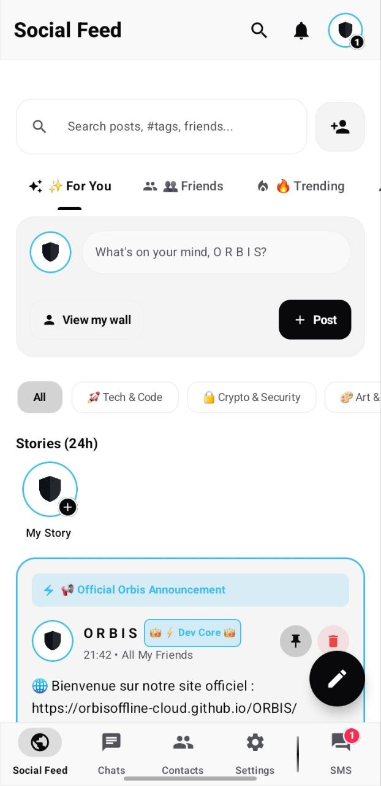
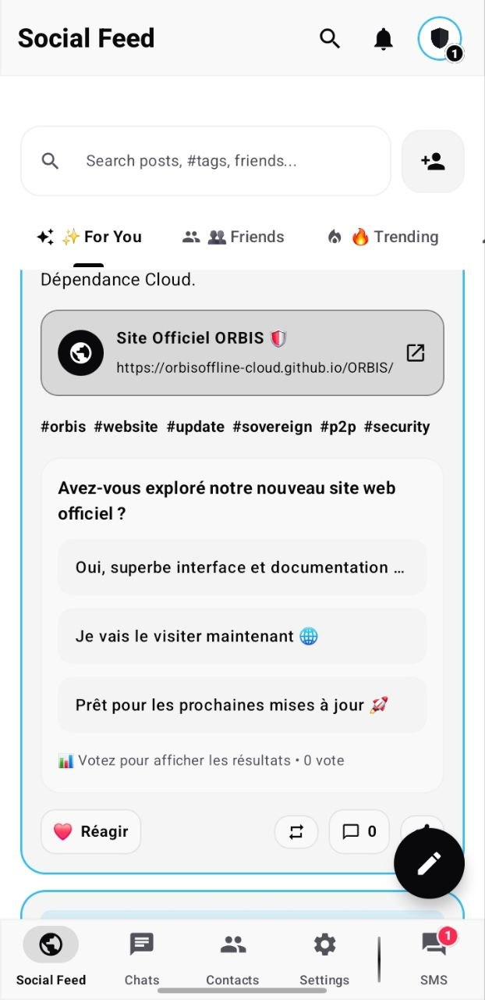
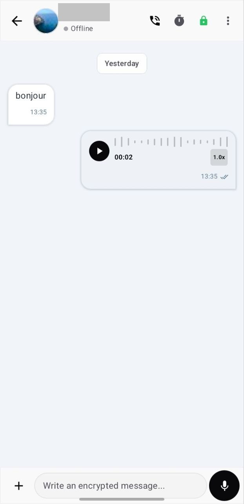
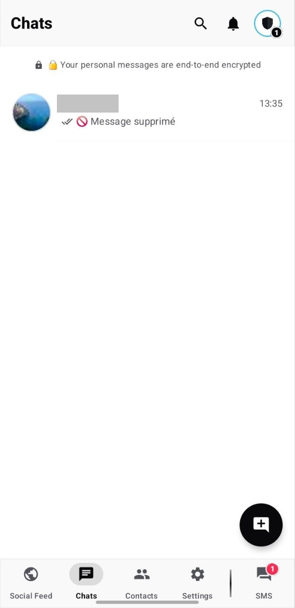
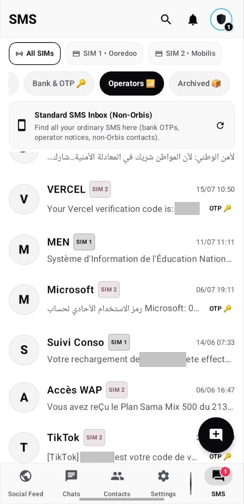
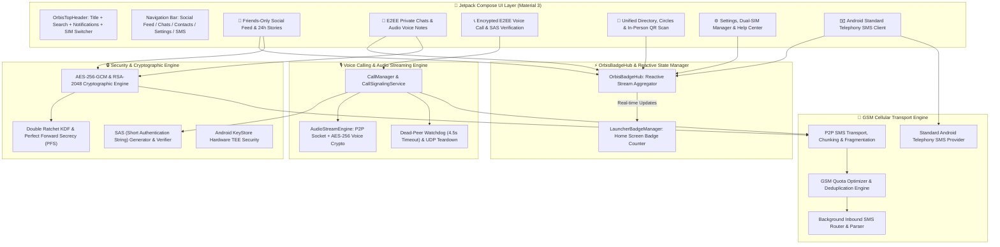

# 🌐 ORBIS — Sovereign Offline Social Network & Encrypted Messaging (P2P SMS & E2EE Voice)

[](https://github.com/orbisoffline-cloud/ORBIS/releases/tag/ORBIS-v1.1.0)
[](https://github.com/orbisoffline-cloud/ORBIS/releases)
[](https://github.com/orbisoffline-cloud/ORBIS/releases/download/ORBIS-v1.1.0/O.R.B.I.S.apk)
[](https://android.com)
[](https://kotlinlang.org)
[](https://developer.android.com/jetpack/compose)
[](https://en.wikipedia.org/wiki/End-to-end_encryption)
[](https://t.me/orbis_community)
[](https://orbisoffline-cloud.github.io/ORBIS/)

---

## 📖 Executive Overview

**ORBIS** is the world's premier sovereign, decentralized social network and end-to-end encrypted messaging platform operating **100% offline with zero internet connectivity and zero cloud servers**, running entirely over the **cellular GSM network (SMS, Voice signaling, and P2P Streaming)**.

Engineered for absolute digital sovereignty, privacy, and censorship resistance during network blackouts or emergency situations, ORBIS consolidates an all-in-one ecosystem:

1. 🛡️ **End-to-End Encrypted Private Messaging** (Signal-style Double Ratchet, HMAC-SHA256, AES-256-GCM, Perfect Forward Secrecy).
2. 📞 **Offline E2EE Encrypted Voice Calls** with GSM SMS signaling (`ORB:CO:`, `ORB:CA:`, `ORB:CE:`), direct AES-256-GCM audio streaming, verbal SAS (Short Authentication String) security verification, and automatic zero-credit fallback to standard GSM telephony.
3. 🎙️ **High-Density Voice Notes via SMS** powered by Deflater ZLIB compression, multi-part fragment assembly, and an interactive waveform audio player (1.0x / 1.5x / 2.0x playback).
4. 📰 **Friends-Only Sovereign Social Network** (Social wall, 24h ephemeral stories, decentralized polls, emoji reactions, and encrypted comment threads) with strict zero-leakage isolation from ordinary phone contacts.
5. 📱 **Native Dual SIM Multi-Carrier Hardware Management** with instant slot switching directly from the avatar profile.
6. 👥 **Unified Phonebook, Circles & Cryptographic QR Pairing** with in-person hardware trust certification.
7. 📖 **Integrated Interactive Help Center & User Guide** featuring offline search and multi-language support (English, French, Arabic).
8. ✉️ **Full-Featured Android Default SMS Telephony Client** capable of seamlessly handling all standard carrier SMS traffic.

---

## 📱 Screenshots & User Interface

<div align="center">

| 📰 Sovereign Social Feed | 📊 Decentralized Polls & Stories | 💬 E2EE Chat & Voice Notes |
|:---:|:---:|:---:|
|  |  |  |

| 🔒 Encrypted Conversations | ✉️ Android SMS & Dual-SIM | ⚙️ Security & Cryptography |
|:---:|:---:|:---:|
|  |  |  | 

</div>

---

## 🏗️ System Architecture



---

## 🌟 Core Features & Capabilities

### 1. 📞 Encrypted E2EE Voice Calling over GSM
- **Offline GSM SMS Signaling Protocol**:
  - Compact call offer packet (`ORB:CO:<port>:<ip>:<key>`).
  - Instant call acceptance handshake (`ORB:CA:<port>:<ip>:<key>`).
  - Secure call termination teardown (`ORB:CE:`).
- **Direct AES-256-GCM Audio Streaming**: Real-time bidirectional encrypted voice stream over peer-to-peer sockets with zero intermediary relay servers.
- **Short Authentication String (SAS) Verification**: Derived cryptographic session visual checksum displayed on both screens for verbal peer validation, immunizing calls against Man-in-the-Middle (MITM) attacks and rogue cellular base stations (IMSI-Catchers).
- **Zero-Credit Intelligent GSM Fallback**: If either participant runs out of SMS balance, ORBIS detects delivery state and prompts instant fallback to standard GSM cellular voice (100% free for receiver).
- **Guaranteed Call Teardown & Dead-Peer Watchdog**: Burst UDP termination packets, SMS teardown, and automated 4.5-second silence shutdown to protect device battery and session confidentiality.

### 2. 💬 Private Messaging (Double Ratchet & PFS)
- **End-to-End Cryptography**: All texts, media, and location shares are encrypted on-device via AES-256-GCM and signed with local RSA-2048 keys.
- **Perfect Forward Secrecy (PFS)**: Ephemeral session keys are recalculated for each message and immediately wiped from RAM (`fill(0)`).
- **Live Delivery Acknowledgments**: Multi-state message tracking (*Sent*, *Delivered*, *Read*).
- **Self-Destructing Timers**: Programmable auto-erase timers (10s, 1m, 1h, 24h, 7d).
- **Offline Satellite GPS Sharing**: Direct satellite GPS coordinate extraction transmitted in a single compact encrypted SMS opening native maps.

### 3. 🎙️ Ultra-Compressed Voice Notes
- **High-Efficiency Voice Codec**: Highly optimized AMR/AAC audio recording paired with ZLIB Deflater compression.
- **Interactive Waveform Player**: Dynamic touch-seeking waveform visualizer, playback speed toggle (1.0x / 1.5x / 2.0x), and sub-second progress counters.

### 4. 📰 Friends-Only Sovereign Social Network
- **Strict Friends-Only Isolation**: Posts, polls, and stories are transmitted exclusively to confirmed friends and trusted circles via GSM P2P with zero leakage to regular phonebook contacts.
- **24-Hour Ephemeral Stories**: Horizontal gallery with glowing rings, seen-state indicators, and automated 24-hour expiration.
- **Decentralized Polls**: Interactive voting with real-time tally aggregation and cryptographic anti-double-vote protection.
- **Rich Interactions**: Emoji reactions (❤️, 🔥, 👏, 💡, 🛡️) and encrypted comment threads.

### 5. 📱 Multi-SIM & Hardware Dual-Line Manager
- **Dynamic SIM Slot Selection**: Seamlessly route SMS and calls through SIM 1 or SIM 2.
- **Isolated Account Profiles**: Independent cryptographic keypairs, avatars, and contact lists per SIM card.

### 6. 🛡️ Invisible SMS Steganography
- **Zero-Width Unicode Concealment**: Binary encrypted payloads are concealed as invisible Unicode zero-width characters inside innocent, everyday plain text messages to bypass deep packet inspection and keyword filters.

---

## 🔒 Security & Cryptographic Architecture

| Layer | Algorithm / Protocol | Implementation Details |
|---|---|---|
| **Identity & Signing** | **RSA-2048** | Hardware-backed keypair generated on-device, SHA-512 signatures |
| **Session Encryption** | **AES-256-GCM** | Authenticated encryption with 128-bit integrity tag |
| **Key Ratchet** | **Double Ratchet (KDF)** | HMAC-SHA256 derivation tree for Perfect Forward Secrecy |
| **Voice Audio Stream** | **AES-256-GCM + SAS** | Direct P2P streaming, verbal Short Authentication String |
| **Data At-Rest** | **Android KeyStore (TEE)** | Master key stored in hardware enclave; anti-ADB extraction |
| **Vault Backups** | **PBKDF2 (100k rounds)** | AES-256-CBC with 128-bit cryptographically secure salt |
| **Steganography** | **Zero-Width Unicode** | Anti-censorship payload concealment inside harmless text |

---

## 📊 GSM SMS Quota Efficiency & Transparency

ORBIS is engineered with extreme byte-level frugality to maximize battery life and minimize carrier SMS usage:

| User Action | GSM SMS Cost | Technical Details |
|---|---|---|
| 💬 **1-on-1 Text Message** | **1 SMS** | Compressed ZLIB + AES-256-GCM + Signature |
| 📞 **E2EE Voice Call Signaling** | **2 SMS** | Session key exchange via SMS • 0 SMS consumed during audio stream |
| 🗺️ **Satellite GPS Location** | **1 SMS** | Ultra-compact binary coordinates (~40 bytes) |
| 👍 **Emoji Reaction / Delivery ACK** | **1 SMS** | Lightweight single-frame acknowledgment packet |
| 👥 **Group Broadcast (N members)** | **(N - 1) SMS** | Direct sovereign P2P dispatch to each circle member |
| 🎙️ **Voice Note (3 to 5 seconds)** | **5 to 12 SMS** | Ultra-compressed AMR/AAC binary payload chunking |

---

## 🔗 Official Links & Community

- 🌐 **Official Website & Downloads**: [https://orbisoffline-cloud.github.io/ORBIS/](https://orbisoffline-cloud.github.io/ORBIS/)
- 💬 **Official Telegram Community**: [https://t.me/orbis_community](https://t.me/orbis_community)
- 🐙 **GitHub Repository**: [https://github.com/orbisoffline-cloud/ORBIS](https://github.com/orbisoffline-cloud/ORBIS)
- 📦 **Direct APK Download**: [O.R.B.I.S. v1.1.0 APK](https://github.com/orbisoffline-cloud/ORBIS/releases/download/ORBIS-v1.1.0/O.R.B.I.S.apk)

---

## 🛠️ Build & Installation

### Prerequisites
- **Android Studio**: Ladybug / Jellyfish or newer
- **Android SDK**: API 26 (Android 8.0 Oreo) up to API 35 (Android 15)
- **Kotlin**: 2.0+
- **JDK**: Java 17+

### Compilation
```bash
# Clone the repository
git clone https://github.com/orbisoffline-cloud/ORBIS.git
cd ORBIS

# Build Debug APK
./gradlew assembleDebug

# Build Release APK
./gradlew assembleRelease
```

---

## 📄 License & Credits

Designed & Developed with sovereign precision by **ShaDevPro**.  
© 2026 **ORBIS Sovereign P2P**. All rights reserved.
