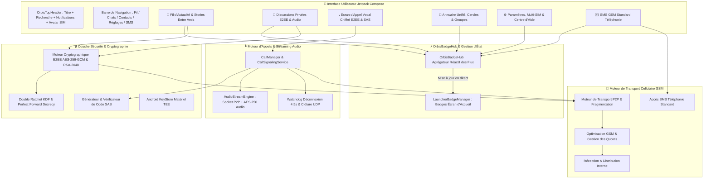

# 🌐 ORBIS — Réseau Social & Messagerie Souveraine Hors-Ligne (P2P SMS & Voix E2EE)

[](https://github.com/orbisoffline-cloud/ORBIS/releases/tag/ORBIS-v1.1.0)
[](https://github.com/orbisoffline-cloud/ORBIS/releases/download/ORBIS-v1.1.0/O.R.B.I.S.apk)
[](https://android.com)
[](https://kotlinlang.org)
[](https://developer.android.com/jetpack/compose)
[](https://en.wikipedia.org/wiki/End-to-end_encryption)
[](CHANGELOG.md)
[](https://orbisoffline-cloud.github.io/ORBIS/)

---

## 📖 Introduction & Présentation

**ORBIS** est une plateforme souveraine de communication et de réseau social décentralisé fonctionnant **intégralement sans connexion Internet et sans serveur centralisé**, en s'appuyant sur le réseau cellulaire **GSM (SMS / Voix / Streaming P2P)**.

Conçue pour garantir une souveraineté numérique et une résilience totale en toutes circonstances, l'application réunit dans un écosystème unifié :
1. 🛡️ **Une Messagerie Privée Chiffrée de Bout en Bout** (Double Ratchet, HMAC-SHA256, AES-256-GCM, PFS).
2. 📞 **Des Appels Vocaux Chiffrés E2EE Hors-Ligne** avec signalisation GSM SMS (`ORB:CO:`, `ORB:CA:`, `ORB:CE:`), streaming direct AES-256-GCM, validation du code SAS et bascule 100% gratuite vers le réseau GSM cellulaire en cas de solde SMS épuisé.
3. 🎙️ **Des Notes Vocales Haute-Qualité par SMS** avec compression Deflater ZLIB et lecteur interactif de forme d'onde (*Waveform*).
4. 📰 **Un Réseau Social P2P "Entre Amis Uniquement"** (Mur social, Stories éphémères 24h, Sondages décentralisés, Réactions et Commentaires) sans aucune fuite vers les contacts téléphoniques ordinaires.
5. 📱 **Une Gestion Multi-SIM & Double Ligne Native** avec bascule instantanée sur l'avatar.
6. 👥 **Un Annuaire Téléphonique Unifié & Groupes Sécurisés** avec certification mutuelle par QR Code en face à face.
7. 📖 **Un Centre d'Aide & Guide Interactif Modulaire** intégré directement dans l'application avec recherche instantanée.
8. ✉️ **Un Client SMS Cellulaire Classique** complet capable de remplacer l'application SMS par défaut du système Android.

---

## 🏗️ Architecture Globale de l'Application



---

## 🌟 Fonctionnalités Principales

### 1. 📞 Appels Vocaux Chiffrés E2EE & Signalisation GSM
- **Signalisation Hors-Ligne par SMS** :
  - Offre d'appel compacte (`ORB:CO:<port>:<ip>:<key>`).
  - Acceptation instantanée (`ORB:CA:<port>:<ip>:<key>`).
  - Clôture sécurisée (`ORB:CE:`).
- **Streaming Audio Direct AES-256-GCM** : Flux voix bidirectionnel chiffré en temps réel de pair à pair sans aucun serveur relais.
- **Code de Sécurité SAS (Short Authentication String)** : Empreinte courte affichée simultanément sur les deux téléphones pour validation orale contre toute attaque de l'homme du milieu (MITM) ou fausses antennes relais (IMSI-Catchers).
- **Bascule Intelligente & Détection de Crédit SMS (0 SMS)** : Si l'un des correspondants ne dispose pas de crédit SMS pour renvoyer la clé chiffrée, proposition automatique de basculer vers un appel GSM cellulaire standard (100% gratuit pour le destinataire en réception).
- **Raccrochage Garanti & Dead-Peer Watchdog** : Rafale de paquets UDP d'extinction immédiate, SMS de fin d'appel et arrêt automatique après 4.5 secondes de silence réseau pour préserver la batterie et l'intégrité de la session.

### 2. 💬 Messagerie Privée (Chiffrement E2EE & Double Ratchet)
- **Sécurité de Bout en Bout** : Textes, fichiers et coordonnées chiffrés directement sur l'appareil émetteur via AES-256-GCM et signatures RSA-2048.
- **Perfect Forward Secrecy (PFS)** : Clés éphémères renouvelées à chaque message et effacées de la mémoire vive (`fill(0)`).
- **Accusés de Réception en Direct** : Suivi des étapes (*Envoi*, *Remis*, *Lu*).
- **Messages Éphémères** : Minuteurs de disparition automatique programmables (10s, 1m, 1h, 24h, 7j).
- **Partage GPS Satellite Hors-Ligne** : Transmission des coordonnées géographiques brutes sans connexion 4G/5G en un seul SMS.

### 3. 🎙️ Notes Vocales Haute-Compression
- **Format Vocal Optimisé** : Enregistrement micro compressé (AMR/AAC) avec Deflater ZLIB.
- **Lecteur Audio Interactif** : Forme d'onde animée (*Waveform*), scrubbing dynamique au toucher, sélecteur de vitesse (1.0x / 1.5x / 2.0x) et décompte précis.

### 4. 📰 Réseau Social P2P "Entre Amis Uniquement"
- **Diffusion Souveraine Exclusive** : Les publications, sondages et stories sont diffusés uniquement aux amis confirmés et cercles de confiance via GSM P2P, sans aucune fuite vers les contacts téléphoniques ordinaires.
- **Stories & Statuts 24h** : Galerie horizontale des statuts éphémères avec anneaux lumineux et expiration après 24 heures.
- **Sondages Décentralisés** : Création d'enquêtes interactives avec dépouillement en temps réel et prévention du double-vote.
- **Interactions Complètes** : Réactions emoji (❤️, 🔥, 👏, 💡, 🛡️) et fils de commentaires chiffrés.

### 5. 👥 Annuaire Téléphonique Unifié, Cercles & Groupes
- **Carnet d'Adresses Intégré** : Synchronisation locale directe avec recherche rapide.
- **Cercles Souverains** : Segmentation des contacts (*Famille*, *Amis*, *Travail*, *Communauté*).
- **Groupes Chiffrés** : Clé AES-256 de groupe partagée et multi-diffusion cellulaire automatique.
- **Échange & Certification QR Code** : Échange de clés publiques en face à face sans ondes GSM.

### 6. 📱 Gestion Multi-SIM & Double Ligne
- **Pastille d'État SIM sur Avatar** : Indicateur compact `SIM 1` / `SIM 2` intégré sur la photo de profil.
- **Bascule en 1 Clic** : Bascule instantanée de la ligne d'émission et profils cryptographiques indépendants.

### 7. 📖 Centre d'Aide & Guide Interactif
- **Guide Modulaire Intégré** : FAQ complète par catégories (*Démarrage*, *Messagerie*, *Appels*, *Réseau Social*, *Sécurité*, *Multi-SIM*).
- **Recherche Instantanée** : Filtrage en temps réel des réponses et astuces d'utilisation.

### 8. 📊 Suivi & Transparence du Quota GSM
- **Compteur de Consommation Réel** : Suivi des messages cellulaires émis aujourd'hui et sur le mois.
- **Sobriété Maximale** : 1 SMS par message texte/GPS/réaction, 2 SMS pour l'initialisation d'un appel vocal, 0 SMS pendant la conversation audio.

---

## 📂 Organisation du Projet (`app/src/main/java/com/sha/orbis/`)

```
com.sha.orbis/
├── admin/                      # Console d'administration & diagnostics système
├── backup/                     # Gestion du coffre-fort chiffré (.orbis) et restauration PBKDF2
├── call/                       # Moteur d'appels vocaux E2EE, signalisation SMS, audio stream & SAS
├── data/                       # Repositories centraux, sessions & Hub de badges réactifs
├── media/                      # Capture audio, compression AMR/AAC & localisation GPS
├── model/                      # Modèles de données (Messages, Discussions, Contacts, Social, Calls)
├── permissions/                # Gestion des permissions Android (Micro, SMS, Téléphonie)
├── security/                   # Cryptographie AES-256-GCM, RSA-2048, KeyStore TEE & Double Ratchet
├── sms/                        # Moteur cellulaire GSM, fragmentation P2P & accusés
├── social/                     # Fil d'actualité P2P, stories 24h, sondages & cercles
│   └── algorithm/              # Algorithme de recommandation et tri local décentralisé
├── storage/                    # Persistance locale Room/SQLite chiffrée
└── ui/                         # Interface Utilisateur Jetpack Compose
    ├── app/                    # Navigation principale & barre d'onglets 2 blocs
    ├── auth/                   # Authentification, déverrouillage PIN & biométrie
    ├── call/                   # Écran d'appel vocal chiffré, clavier, statut SAS & bascule GSM
    ├── chat/                   # Sélection de contact & nouvelles discussions
    ├── components/             # Composants réutilisables (Header, Badges, Waveform, Avatars)
    ├── contacts/               # Annuaire téléphonique unifié, QR Code & fiches
    ├── conversation/           # Écran de discussion chiffrée, lecteur audio & éphémère
    ├── feedback/               # Rapports de diagnostic chiffrés pour le développeur
    ├── groups/                 # Création et gestion des groupes chiffrés
    ├── help/                   # Centre d'aide, FAQ modulaire & guides
    ├── notifications/          # Centre de notifications unifié
    ├── plainsms/               # Client SMS standard opérateur
    ├── profile/                # Gestion du profil, enrichissement & mur social
    ├── settings/               # Paramètres, gestion Multi-SIM, quotas & coffre
    └── social/                 # Mur d'actualité, stories 24h & sondages
```

---

## 🌍 Internationalisation (i18n)

| Langue | Support | Disposition |
| :--- | :--- | :--- |
| 🇫🇷 **Français** | Intégral (App + Site Web + Guide) | LTR |
| 🇬🇧 **Anglais** | Intégral (App + Site Web + Guide) | LTR |
| 🇸🇦 **Arabe** | Intégral (App + Site Web + Guide) | RTL natif |

---

## 🛠️ Stack Technique

- **Langage** : Kotlin 2.0+ (Coroutines, Flow & StateFlow)
- **Interface Utilisateur** : Jetpack Compose & Material 3
- **Architecture** : Architecture Propre & Flux de Données Unidirectionnel (MVI / MVVM)
- **Cryptographie** : BouncyCastle, Java Cryptography Architecture (JCA), Android KeyStore (TEE)
- **Audio & Streaming** : Android AudioRecord / AudioTrack, sockets UDP pair-à-pair, AMR-WB / AAC
- **Compatibilité** : Android 8.0 (API 26) jusqu'à Android 15 (API 35)

---

## 🚀 Compilation & Installation

```bash
# Générer l'APK de Débogage
./gradlew assembleDebug

# Générer l'APK de Production / Release
./gradlew assembleRelease

# Lancer la suite de tests unitaires
./gradlew test
```

L'exécutable généré se trouve dans :  
`app/build/outputs/apk/release/app-release.apk`

---

## 📜 Licence
Projet développé sous licence souveraine dédiée à la confidentialité absolue, à la résilience hors-ligne et à la liberté de communication.

